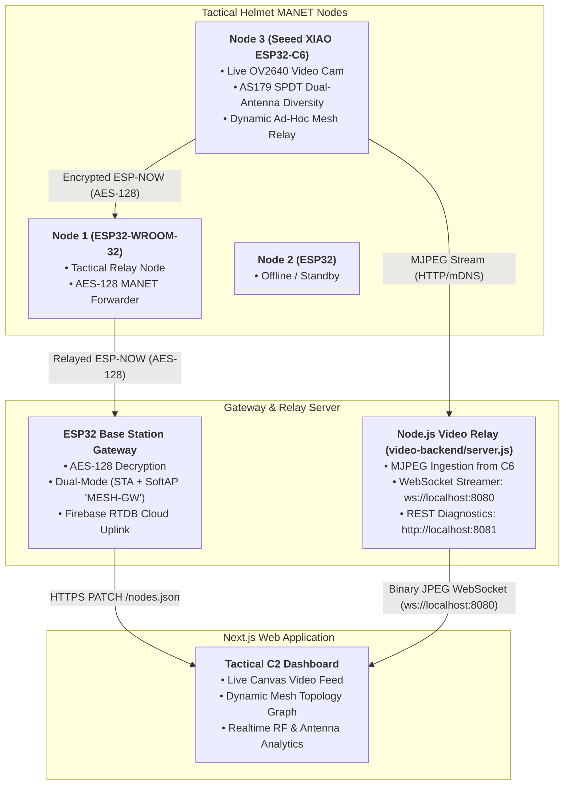

# Tactical Helmet Mesh System: Video Stream & Dynamic Topology Integration Guide

> **Target Audience:** Frontend Developer / AI Agent integrating live video and ad-hoc topology into the Next.js Tactical Command Center.

---

## 1. System Architecture & New Context

The system has been upgraded to a **Tactical Ad-Hoc MANET Mesh with Live Helmet Video & Hardware Antenna Diversity**.



### Key Technical Enhancements:
1. **ESP32-C6 Helmet Node with Live Camera**:
   - Runs an OV2640 camera streaming MJPEG over HTTP on `http://esp32-c6-cam.local/stream`.
   - Dynamically evaluates and switches between **Antenna 1 (Front Patch)** and **Antenna 2 (Rear Whip)** using an onboard Skyworks AS179-92LF RF switch with a 4 dB hysteresis threshold.
2. **AES-128 Encrypted MANET Mesh**:
   - All soldier-to-soldier and soldier-to-gateway ESP-NOW communications are encrypted in CBC mode using a 128-bit pre-shared key (`mesh_proto.h`).
3. **Dynamic RSSI Ad-Hoc Topology**:
   - Every node continuously tracks the direct RSSI of its neighbors and gateway.
   - If direct Gateway RSSI drops below **-75 dBm**, the node autonomously re-routes its telemetry and status through the strongest neighboring relay (`bestRelayId`, `linkRssi`), adapting the mesh topology in real time.
4. **Node.js WebSocket Video Relay (`video-backend/`)**:
   - Ingests raw multipart MJPEG frames from the helmet camera, parses binary JPEG frames (bounded by `0xFFD8` and `0xFFD9`), and broadcasts raw binary frame buffers to connected frontend clients over `ws://localhost:8080`.

---

## 2. Backend Endpoints & Data Specifications

### WebSocket Video Feed (`ws://localhost:8080`)
- **Protocol**: Raw binary ArrayBuffer containing JPEG image data.
- **Handshake / Control Message** (JSON format on connection):
  ```json
  {
    "type": "STREAM_METADATA",
    "nodeId": "node-3",
    "name": "ESP32-C6 Helmet Node 3",
    "fps": 15,
    "connected": true
  }
  ```

### Video Diagnostics & Control REST API (`http://localhost:8081`)
- **`GET /api/status`**: Returns live stream health, current FPS, active source node, and connected viewer count.
- **`POST /api/select-source`**: Switches active camera source:
  ```json
  { "nodeId": "node-3" }
  ```

### Firebase Realtime Database Schema (`/nodes.json`)
```json
{
  "node-1": {
    "lat": 12.908100,
    "lon": 77.567900,
    "data": {
      "rssiNode": -62,
      "rssiGw": -58,
      "antenna": 0,
      "hops": 0,
      "bestRelayId": 0,
      "linkRssi": -58,
      "hasVideo": 0,
      "seq": 142
    },
    "ts": 1727332800000
  },
  "node-3": {
    "lat": 12.907200,
    "lon": 77.566300,
    "data": {
      "rssiNode": -78,
      "rssiGw": -74,
      "antenna": 1,
      "hops": 1,
      "bestRelayId": 1,
      "linkRssi": -65,
      "hasVideo": 1,
      "seq": 189
    },
    "ts": 1727332800000
  }
}
```

---

## 3. Frontend Integration Instructions for AI Agent

### Step 1: Create the Live Video Feed Component
Create `components/LiveCameraFeed.tsx` in your Next.js project. This component connects to `ws://localhost:8080`, decodes incoming binary JPEG blobs, draws them onto an HTML5 Canvas with low latency, and displays real-time FPS and RF telemetry badges.

```tsx
'use client';

import React, { useEffect, useRef, useState } from 'react';
import { Camera, Signal, Radio, Maximize2, RefreshCw, AlertTriangle } from 'lucide-react';

interface LiveCameraFeedProps {
  nodeId?: string;
  nodeName?: string;
  activeAntenna?: number;
  rssi?: number;
  hops?: number;
}

export default function LiveCameraFeed({
  nodeId = 'node-3',
  nodeName = 'ESP32-C6 Helmet Cam',
  activeAntenna = 1,
  rssi = -74,
  hops = 1,
}: LiveCameraFeedProps) {
  const canvasRef = useRef<HTMLCanvasElement | null>(null);
  const containerRef = useRef<HTMLDivElement | null>(null);
  
  const [streamStatus, setStreamStatus] = useState<'connecting' | 'connected' | 'disconnected' | 'error'>('connecting');
  const [fps, setFps] = useState<number>(0);
  const [frameCount, setFrameCount] = useState<number>(0);
  const [latencyMs, setLatencyMs] = useState<number>(32);
  const [isFullscreen, setIsFullscreen] = useState<boolean>(false);

  useEffect(() => {
    let ws: WebSocket | null = null;
    let reconnectTimeout: NodeJS.Timeout;
    let frameTimes: number[] = [];
    let isSubscribed = true;

    const connectWebSocket = () => {
      if (!isSubscribed) return;
      setStreamStatus('connecting');

      ws = new WebSocket('ws://localhost:8080');
      ws.binaryType = 'arraybuffer';

      ws.onopen = () => {
        if (!isSubscribed) return;
        setStreamStatus('connected');
      };

      ws.onmessage = (event: MessageEvent) => {
        if (!isSubscribed) return;

        // Handle binary JPEG buffer
        if (event.data instanceof ArrayBuffer) {
          const now = performance.now();
          frameTimes.push(now);
          if (frameTimes.length > 20) frameTimes.shift();

          // Calculate current FPS
          if (frameTimes.length >= 2) {
            const timeDiff = (frameTimes[frameTimes.length - 1] - frameTimes[0]) / (frameTimes.length - 1);
            setFps(Math.round(1000 / timeDiff));
          }

          setFrameCount((prev) => prev + 1);

          const blob = new Blob([event.data], { type: 'image/jpeg' });
          const img = new Image();
          img.onload = () => {
            const canvas = canvasRef.current;
            if (canvas && isSubscribed) {
              const ctx = canvas.getContext('2d');
              if (ctx) {
                ctx.drawImage(img, 0, 0, canvas.width, canvas.height);
              }
            }
            URL.revokeObjectURL(img.src);
          };
          img.src = URL.createObjectURL(blob);
        } else if (typeof event.data === 'string') {
          try {
            const meta = JSON.parse(event.data);
            if (meta.type === 'STREAM_METADATA') {
              console.log('[LiveCameraFeed] Stream metadata received:', meta);
            }
          } catch (e) {}
        }
      };

      ws.onerror = () => {
        if (!isSubscribed) return;
        setStreamStatus('error');
      };

      ws.onclose = () => {
        if (!isSubscribed) return;
        setStreamStatus('disconnected');
        reconnectTimeout = setTimeout(connectWebSocket, 3000);
      };
    };

    connectWebSocket();

    return () => {
      isSubscribed = false;
      if (ws) ws.close();
      if (reconnectTimeout) clearTimeout(reconnectTimeout);
    };
  }, [nodeId]);

  const toggleFullscreen = () => {
    if (!containerRef.current) return;
    if (!document.fullscreenElement) {
      containerRef.current.requestFullscreen().catch(err => console.error(err));
      setIsFullscreen(true);
    } else {
      document.exitFullscreen();
      setIsFullscreen(false);
    }
  };

  return (
    <div
      ref={containerRef}
      className="relative flex flex-col bg-slate-900 border border-slate-700/60 rounded-xl overflow-hidden shadow-2xl backdrop-blur-md"
    >
      {/* Top Header Bar */}
      <div className="flex items-center justify-between px-4 py-2.5 bg-slate-800/80 border-b border-slate-700/50">
        <div className="flex items-center gap-2.5">
          <span className="relative flex h-3 w-3">
            {streamStatus === 'connected' ? (
              <>
                <span className="animate-ping absolute inline-flex h-full w-full rounded-full bg-emerald-400 opacity-75"></span>
                <span className="relative inline-flex rounded-full h-3 w-3 bg-emerald-500"></span>
              </>
            ) : (
              <span className="relative inline-flex rounded-full h-3 w-3 bg-rose-500"></span>
            )}
          </span>
          <h3 className="font-semibold text-sm text-slate-100 flex items-center gap-2">
            <Camera className="w-4 h-4 text-cyan-400" />
            {nodeName} ({nodeId.toUpperCase()})
          </h3>
        </div>

        {/* Live HUD Badges */}
        <div className="flex items-center gap-3 text-xs">
          <div className="flex items-center gap-1 px-2 py-0.5 rounded bg-slate-700/60 text-slate-300 font-mono">
            <Radio className="w-3.5 h-3.5 text-cyan-400" />
            <span>ANT-{activeAntenna === 1 ? '1 (Front)' : '2 (Rear)'}</span>
          </div>

          <div className="flex items-center gap-1 px-2 py-0.5 rounded bg-slate-700/60 text-slate-300 font-mono">
            <Signal className="w-3.5 h-3.5 text-emerald-400" />
            <span>{rssi} dBm</span>
          </div>

          <div className="px-2 py-0.5 rounded bg-cyan-950/80 border border-cyan-800 text-cyan-300 font-mono font-medium">
            {fps > 0 ? `${fps} FPS` : 'STANDBY'}
          </div>

          <button
            onClick={toggleFullscreen}
            className="p-1 rounded hover:bg-slate-700 text-slate-400 hover:text-slate-100 transition"
            title="Toggle Fullscreen"
          >
            <Maximize2 className="w-4 h-4" />
          </button>
        </div>
      </div>

      {/* Video Viewport Area */}
      <div className="relative aspect-video bg-black flex items-center justify-center">
        <canvas
          ref={canvasRef}
          width={640}
          height={480}
          className="w-full h-full object-contain"
        />

        {/* Overlay Overlay States */}
        {streamStatus !== 'connected' && (
          <div className="absolute inset-0 bg-slate-950/85 backdrop-blur-sm flex flex-col items-center justify-center gap-3 p-6 text-center">
            {streamStatus === 'connecting' && (
              <>
                <RefreshCw className="w-8 h-8 text-cyan-400 animate-spin" />
                <p className="text-sm font-medium text-slate-200">Connecting to Tactical Video Bridge (ws://localhost:8080)...</p>
                <p className="text-xs text-slate-400">Verifying ESP32-C6 MJPEG stream feed</p>
              </>
            )}
            {streamStatus === 'disconnected' && (
              <>
                <AlertTriangle className="w-8 h-8 text-amber-400 animate-bounce" />
                <p className="text-sm font-medium text-amber-200">Video Bridge Disconnected</p>
                <p className="text-xs text-slate-400">Ensure <code>node video-backend/server.js</code> is running.</p>
              </>
            )}
            {streamStatus === 'error' && (
              <>
                <AlertTriangle className="w-8 h-8 text-rose-500" />
                <p className="text-sm font-medium text-rose-200">Stream Connection Error</p>
                <p className="text-xs text-slate-400">Check Wi-Fi connectivity and mDNS domain http://esp32-c6-cam.local</p>
              </>
            )}
          </div>
        )}

        {/* Live OSD (On-Screen Display) Overlay */}
        {streamStatus === 'connected' && (
          <div className="absolute bottom-2 left-2 right-2 flex items-center justify-between text-[11px] font-mono text-white/80 bg-slate-950/60 px-2.5 py-1 rounded backdrop-blur-sm">
            <span>RES: 640x480 VGA</span>
            <span>ENCRYPT: AES-128 CBC</span>
            <span>MANET HOPS: {hops}</span>
            <span>FRAMES: {frameCount}</span>
          </div>
        )}
      </div>
    </div>
  );
}
```

---

### Step 2: Embedding in Dashboard or Modals
Import `<LiveCameraFeed />` inside your tactical dashboard view (e.g. `app/dashboard/page.tsx` or alongside your Node detail panel):

```tsx
import LiveCameraFeed from '@/components/LiveCameraFeed';

export default function TacticalCommandPage() {
  return (
    <div className="grid grid-cols-1 lg:grid-cols-3 gap-6 p-6">
      {/* Left 2 Cols: Live Video & Tactical HUD */}
      <div className="lg:col-span-2 space-y-6">
        <LiveCameraFeed
          nodeId="node-3"
          nodeName="Soldier Lead Helmet (ESP32-C6)"
          activeAntenna={1}
          rssi={-74}
          hops={1}
        />
      </div>

      {/* Right Col: Map & Ad-Hoc Topology Graph */}
      <div className="lg:col-span-1">
        {/* Dynamic Topology & Alert Panels */}
      </div>
    </div>
  );
}
```

---

## 4. Colleague Agent Checklist

When integrating the frontend components:
- [x] **No WebRTC setup needed**: Stream is delivered directly as binary JPEG buffers over WebSocket (`ws://localhost:8080`).
- [x] **Zero memory leak guarantee**: Always use `URL.revokeObjectURL(img.src)` after loading frames into the HTML5 canvas context.
- [x] **Dynamic Node Switch**: To switch video to another camera-enabled soldier node, perform `POST http://localhost:8081/api/select-source` with `{ "nodeId": "node-3" }`.
- [x] **Respect Offline States**: If a node is marked offline (e.g., `Node 2`), show standard nil/standby state without launching unnecessary video requests.
